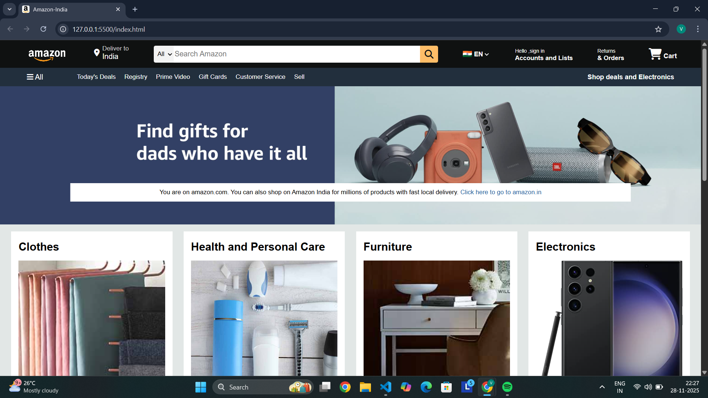

# Amazon Clone – HTML & CSS

A simple frontend Amazon homepage clone created using HTML and CSS.  
Made for practice and learning purposes.

## Features
- Navigation bar with logo and search bar  
- Hero banner  
- Product cards sections  
- Footer similar to Amazon  
- Clean and organized layout

## Screenshot

## Tech Stack
- HTML  
- CSS  

## How to Run
1. Download the repository  
2. Open `index.html` in your browser

## Future Improvements
- Add responsiveness for mobile devices  
- Add login page UI  
- Add product details page  
- Add hover animations  
- Add JavaScript for dynamic actions  
- Add dark mode toggle  

## Contributing
Contributions are welcome!  
If you’d like to improve the project:
1. Fork the repository  
2. Create a new branch  
3. Make changes  
4. Open a pull request  

## Author
Vishnu Vinodan  
GitHub: https://github.com/Vishnu-vkn
